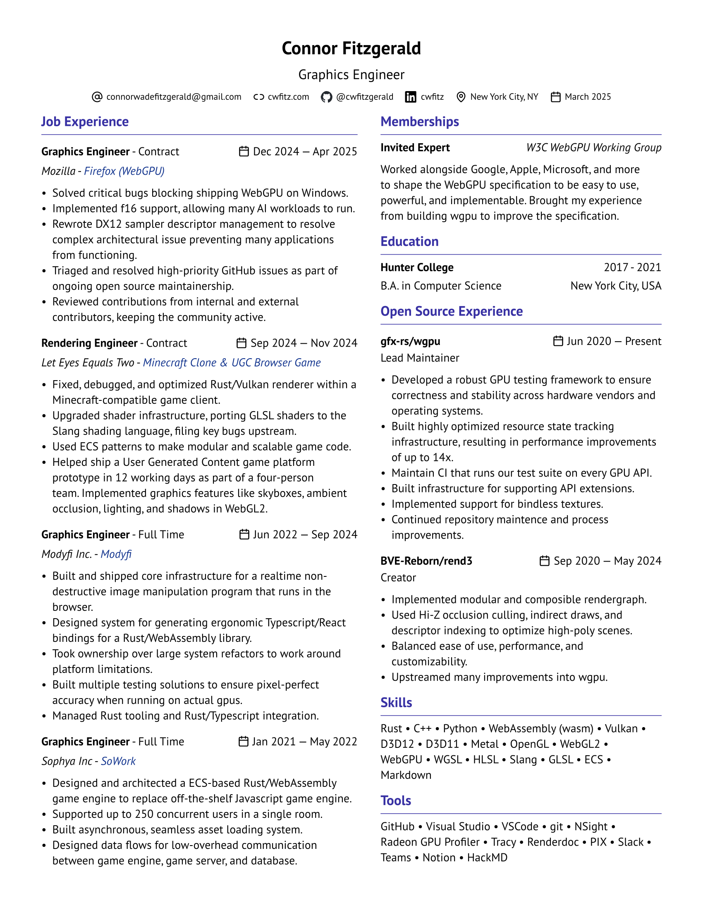

# My CV

This is the sourcecode for my CV. It is written in [Typst](https://typst.app/home). Once it [is installed](https://github.com/typst/typst?tab=readme-ov-file#installation) and in your `PATH`. Compile it by running `bash build.bash`.

This will output a `out/cv.pdf` and `out/cv.png` file.

You can also see my latest CV on my website [cwfitz.com/cv.pdf](https://cwfitz.com/cv.pdf).

## Preview

#

## License

This source is licensed under MIT/Apache-2.0/Zlib. See the license files for more information.

Contains code from the [vantage-cv](https://typst.app/universe/package/vantage-cv) template. MIT licensed.

Fonts are from [Google Fonts](https://fonts.google.com/). They are licensed under the [Open Font License](https://openfontlicense.org/).
